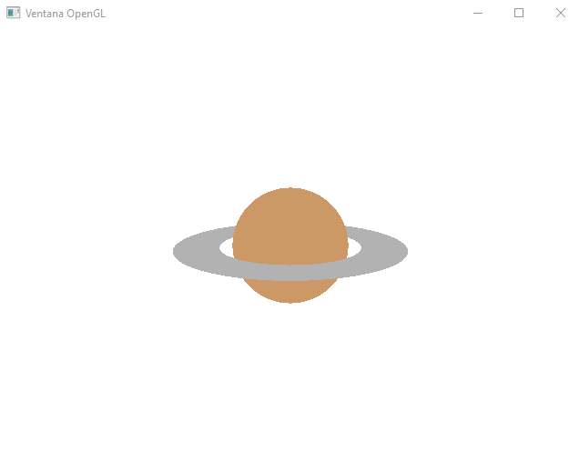

# 🪐 OpenGL - Planeta Saturno 3D (Básico)

<p align="center">
  
</p>

---

## 📌 Descripción

Este proyecto muestra un **modelo básico en 3D del planeta Saturno** usando OpenGL con GLUT.

Incluye:

* Esfera (planeta)
* Anillos (gluDisk)
* Proyección en perspectiva
* Cámara (gluLookAt)
* Z-buffer (profundidad)

⚠️ **Nota:**
Este es un modelo **simple (sin texturas ni iluminación avanzada)**, pensado como base para proyectos más complejos como un **sistema solar**.

---

## 🧰 Requisitos

* IDE: Zinjai
* OpenGL + GLUT
* Compilador C++

---

## 📂 Estructura del proyecto

```bash
.
├── main.cpp
├── SATURNO.zpr
├── debug.w32/
├── vista-previa-saturno.png
├── ventana.png
└── zinjai.png
```

---

## ▶️ Cómo abrir el proyecto en Zinjai

1. Abrir **Zinjai**
2. Ir a **Archivo → Abrir**
3. Arrastrar los siguientes archivos al entorno:

   * `main.cpp`
   * `SATURNO.zpr`
   * `debug.w32/`
4. Abrir el archivo `main.cpp`
5. Ejecutar el proyecto

---

## 🖥️ Resultado esperado

Al ejecutar, se mostrará una ventana de OpenGL con el planeta Saturno:

<p align="center">
  
</p>

---

## 🚀 Posibles mejoras

Este proyecto puede ampliarse agregando:

* Texturas al planeta
* Iluminación (lighting)
* Rotación del planeta y anillos
* Sistema solar completo

---

## 🎓 Uso

Ideal para:

* Estudiantes de computación gráfica
* Ejemplos básicos de OpenGL
* Base para proyectos más complejos

---
